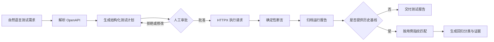

# AgentQA

**OpenAPI 驱动的智能 API 测试与回归分析 Agent**

AgentQA 将自然语言测试需求转换为可审查、可执行、可追溯的 API 测试任务。系统解析 OpenAPI 3.x 文档，生成结构化测试计划，经过人工审批后执行确定性断言，并保存每次运行的完整证据。修复后的测试结果可以与历史基线直接比较，自动识别已修复缺陷、新增缺陷和仍未解决的问题。

项目覆盖从需求理解、计划审批、接口执行、缺陷证据到回归报告交付的完整流程，适用于本地 API 的契约验证、修复复测和版本回归。

## 已完成功能

### OpenAPI 测试建模

- 解析 OpenAPI 3.x JSON 与 YAML 文档；
- 解析本地 `$ref`、路径参数、查询参数、请求体和响应定义；
- 将接口规范归一化为 Pydantic 数据模型；
- 自动生成正常、异常、边界与资源删除测试场景；
- 为测试计划生成稳定 `plan_id`，保证审批内容与执行内容一致。

### 人工审批与安全执行

- 在发送 HTTP 请求前展示方法、路径、规则、请求数据和预期结果；
- 对 POST、PUT、PATCH、DELETE 等操作执行明确的人工审批流程；
- 执行器再次校验 `approved` 状态，未批准时拒绝发送请求；
- 限制目标为允许名单中的本地地址，并校验协议、主机、端口和请求路径；
- 禁止重定向、环境代理和越界路径，降低 SSRF 与误操作风险；
- OpenAPI 文档读取限制为 2 MiB，避免异常输入占用过多资源。

### 确定性测试与缺陷证据

- 使用 HTTPX 异步执行测试计划；
- 校验 HTTP 状态码、响应 Schema、空响应体规则和响应时延；
- 将网络错误与契约失败分开记录；
- 为每条失败保存断言类型、失败原因、实际状态码、响应内容和耗时；
- 由 Python 规则引擎计算通过或失败，大模型负责流程编排和结果解释。

### 历史运行与回归分析

- 每次执行生成唯一 `run_id`；
- 保存报告 Schema 版本、测试计划快照和稳定用例指纹；
- 按运行 ID 归档 JSON 报告、Markdown 报告和实际执行计划；
- 保留根目录最新报告别名，同时保证历史文件不可覆盖；
- 比较修复前后的两次报告，不重新发送 HTTP 请求；
- 输出已修复、新增缺陷、仍未解决和持续通过四类结果；
- 单独列出新增用例、缺失用例、测试条件变化和网络执行错误；
- 校验报告计数、计划快照、目标地址、用例 ID 和指纹，拒绝不可靠的比较输入；
- 支持同计划 ID 的旧版报告兼容比较，并明确给出兼容性警告。

### 报告与交互

- 生成适合阅读的 Markdown 测试报告和机器可读 JSON 报告；
- 生成包含修复前后证据的 Markdown/JSON 回归报告；
- 在消息界面中结构化展示测试计划；
- 从对应工具结果读取真实 Artifact 路径，避免历史报告被“最新报告”覆盖；
- 支持直接下载某次执行或某次比较产生的文件。

## 工作流程



完整工作流由三个工具组成：

| 工具 | 作用 | 是否发送测试请求 |
|---|---|---:|
| `agentqa_create_test_plan` | 解析规范并生成待审批计划 | 否 |
| `agentqa_execute_test_plan` | 执行已批准计划并归档报告 | 是 |
| `agentqa_compare_test_reports` | 比较两份历史报告并生成回归结论 | 否 |

## 回归分类规则

AgentQA 以相同测试条件下的用例状态变化进行分类：

| 修复前 | 修复后 | 分类 | 含义 |
|---|---|---|---|
| 失败 | 通过 | 已修复 `fixed` | 原失败用例已经通过 |
| 通过 | 失败 | 新增缺陷 `new_defect` | 原通过用例在当前运行失败 |
| 失败 | 失败 | 仍未解决 `unresolved` | 两次运行均失败，并保留两侧证据 |
| 通过 | 通过 | 持续通过 `persistent_pass` | 两次运行均通过 |

分类统计的是测试用例状态，不推断独立根因数量。若两次失败的断言证据发生变化，报告会标记 `evidence_changed`，便于判断问题是否发生转移。

网络失败归入 `execution_error`，不会误判成产品缺陷。新增、删除或修改了测试条件的用例分别归入 `added_case`、`missing_case` 和 `changed_case`，不会被标记为已修复。

## 用例匹配与可信性校验

新版报告使用 SHA-256 用例指纹完成跨运行匹配。指纹覆盖：

- HTTP 方法与路径模板；
- 路径、查询、请求头和请求体；
- 预期状态码与响应 Schema；
- 空响应体要求和时延阈值；
- 用例规则。

用例编号和展示名称不参与指纹计算，因此重新排序或重命名不会破坏匹配；请求或断言条件发生变化时则不会被当成同一条用例。比较前还会核对 API 名称、目标地址、报告计数、计划快照、运行 ID 和失败证据一致性。

## 报告结构

每次执行按唯一运行 ID 保存：

```text
agentqa/runs/<run_id>/
├── agentqa-plan.json
├── agentqa-report.json
└── agentqa-report.md
```

每次比较保存：

```text
agentqa/comparisons/<comparison_id>/
├── agentqa-regression.json
└── agentqa-regression.md
```

执行报告包含规范版本、运行 ID、计划快照、目标地址、汇总计数和逐用例证据。回归报告包含两次运行引用、八类统计、配对结果、覆盖变化与警告信息。

## 项目结构

```text
backend/
├── agentqa/
│   ├── openapi_parser.py    # OpenAPI 解析与规范归一化
│   ├── case_generator.py    # 用例生成、计划 ID 与用例指纹
│   ├── executor.py          # 审批校验与异步 HTTP 执行
│   ├── assertions.py        # 状态码、Schema、Body、时延断言
│   ├── regression.py        # 历史报告校验、匹配与回归分类
│   ├── reporter.py          # 测试报告和回归报告生成
│   ├── security.py          # 本地目标与请求路径安全校验
│   ├── models.py            # Pydantic 数据契约
│   └── tools.py             # 三个 Agent 工具与 Artifact 交付
├── agentqa_demo/            # 固定行为的本地验收 API
├── packages/harness/        # Agent 运行时、工具和中间件
└── tests/                   # 后端、AgentQA 与验收 API 测试

frontend/
├── src/components/workspace/messages/
│   ├── agentqa-plan-card.tsx
│   └── message-list.tsx
├── src/core/messages/utils.ts
└── tests/                   # Artifact 提取单元测试与浏览器验收

docker/                                  # 前端、网关和验收 API 容器编排
scripts/                                 # 安装、启动、停止与环境检查脚本
skills/public/agentqa-api-testing/       # Agent 工作流与审批规范
docs/agentqa-regression.md               # 回归数据模型和兼容规则
```

## 快速开始

推荐使用 Docker Desktop 与 Git Bash 运行完整环境。本地开发需要 Python 3.12+、uv、Node.js 和 pnpm。

```bash
git clone https://github.com/hsfbxzj/AgentQA.git
cd AgentQA
cp .env.example .env
cp config.example.yaml config.yaml
```

在 `.env` 中设置模型密钥，并在 `config.yaml` 的 `models` 中启用所需模型。密钥通过环境变量引用，不写入 YAML。

启动完整环境：

```bash
./scripts/docker.sh start
```

- AgentQA 工作区：<http://localhost:2026>
- 验收 API Swagger：<http://localhost:8003/docs>
- 验收 API OpenAPI：<http://localhost:8003/openapi.json>

停止服务：

```bash
./scripts/docker.sh stop
```

只运行 AgentQA 后端测试：

```bash
cd backend
uv sync
uv run pytest tests/agentqa tests/agentqa_demo -q
```

运行前端测试和类型检查：

```bash
cd frontend
pnpm install
pnpm test
pnpm typecheck
```

验收 API 提供 5 个业务接口，并固定保留 3 个契约缺陷。正确执行结果为 `5 cases / 2 passed / 3 failed`，三条失败分别覆盖响应字段类型、无效登录状态码、删除接口状态码与响应体规则。

## 验证结果

当前版本已完成以下自动化验证：

- AgentQA 后端测试：`55 passed, 3 xfailed`；
- 前端单元测试：`341 passed`；
- TypeScript 类型检查、Ruff 和 ESLint 检查通过；
- 浏览器端历史报告与回归报告下载场景通过；
- 3 个 `xfail` 对应验收 API 中固定保留的 3 个契约缺陷。

## 使用示例

创建测试计划时提供 OpenAPI 地址和目标地址：

```text
/agentqa-api-testing 测试 http://agentqa-demo-api:8000/openapi.json，
目标地址为 http://agentqa-demo-api:8000。先展示完整测试计划，等我确认后再执行。
```

修复接口后，指定修复前后的报告：

```text
比较修复前 run-<baseline> 和修复后 run-<current> 的 AgentQA 报告，
列出已修复缺陷、新增缺陷、仍未解决的问题和覆盖变化。
```

当两份报告已经存在时，比较工具直接读取历史结果，不要求重新执行接口测试。

## 技术栈

| 层次 | 技术 |
|---|---|
| Agent 编排 | LangChain Tool、LangGraph Command、Skill、Human-in-the-loop |
| 测试引擎 | Python、HTTPX、Pydantic、PyYAML |
| 接口服务 | FastAPI、Uvicorn |
| 前端交互 | React、TypeScript、Next.js |
| 工程验证 | Pytest、Rstest、Playwright、ESLint、TypeScript |
| 部署 | Docker Compose |

## 安全边界

- 测试执行仅允许访问配置中的本地目标；
- OpenAPI URL 使用相同的目标校验，不跟随重定向；
- 请求路径必须是相对 API 路径，不能覆盖已批准主机；
- 有副作用的测试计划必须经过明确批准；
- `.env`、`config.yaml`、运行日志和生成报告已加入忽略规则；
- 示例配置只通过环境变量读取模型密钥。

## License

本项目采用 [MIT License](./LICENSE)。第三方组件的版权与许可证信息见 [THIRD_PARTY_NOTICES.md](./THIRD_PARTY_NOTICES.md)。
